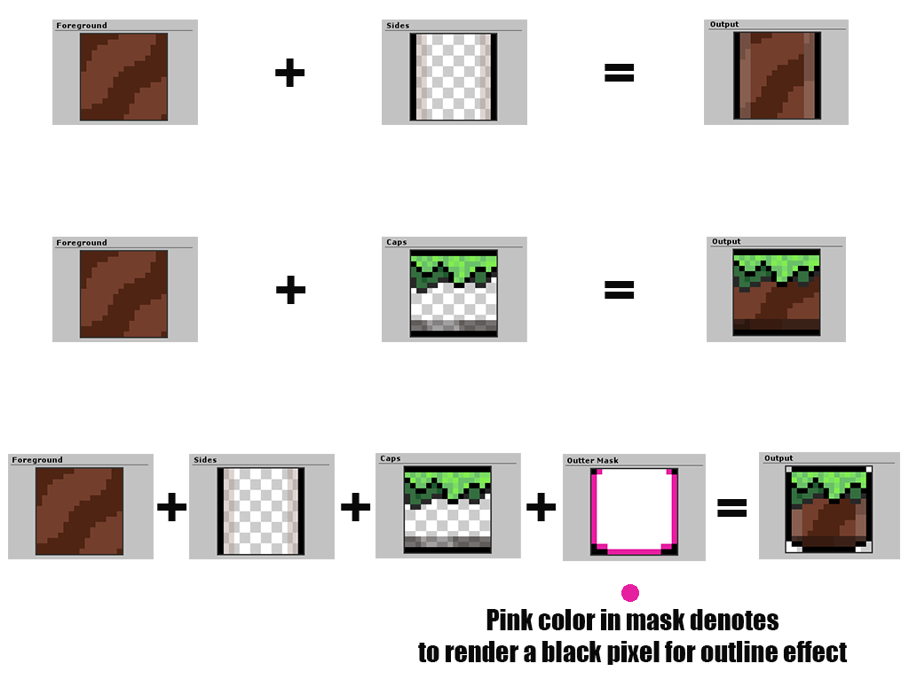
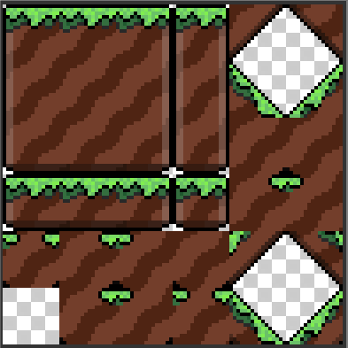

<h1 align="center">
    
</h1>

<h4 align="center">Tile Architect is a Unity editor tool for generation of 2D tilemap tilesets. It comes with a suite of features and tools to vastly speed up the development and iteration cycle when creating 2D tilesets in Unity.</h4>

  <a href="#how-it-works">How It Works?</a> •
  <a href="#what-it-looks-like">UI</a> •
  <a href="#example-output">Output</a> •
  <a href="#current-features">Features</a>

    

# Introduction
`Tile Architect` was inspired by a number factors in my personal adventures doing game jams and creating the painstakingly tedious tileset art assets over and over.  I've watched many videos on YouTube about how to create certain tileset effects and this got me thinking there has to be a better way.  My day job is as a software engineer so I figured lets use these skills to make making art easier and faster - then the Unity 2D challenge happened and I thought what a better time then this to dive into this project and make something to help everyone else too.  With that I set out to make a tool to help others make their 2D tilemap dreams come true easier, faster and (hopefully) better (or at least more consistent).

# How it works?

    

`Tile Architect` takes a set of source images (and 2 masks) and composites them togeather for you a number of ways that eventually ends with 53 unique (Square) tiles including 45 degree slopes, all inward corner variations, horizontal and vertical single tile platforms and much more!  The above diagram trys to illustrate this compositing concept.

# What it looks like?

    

# Example Output

    

`Tile Architect` will output a compact image with all of the tiles composited into a "texture atlas" for use with many other programs (but the intended usecase is with Unity)

This tileset is then also loaded into Unity's "rule tile" for use with Unity's 2D Tilemap system to make painting your level easier, faster and to place all the inward corners, slopes and different tile types correctly for you automatically.  An example end result when applyed to a 2D Tilemap is shown below.

    

## Current Features
* Generation of 53 unique (Square) tiles including 45 degree slopes, all inward corner variations, horizontal and vertical single tile platforms
* Supports 4x4, 8x8, 16x16, 32x32, 64x64 and 128x128 tile sizes
* Generation of rule tile asset that helps integrate tileset with Unity's 2D Tilemap system
* `Pixel Editor` for interactively painting on source textures with realtime preview of changes made
* `Pixel Editor` is also standalone for loading, editing and saving other 2D texture assets
* Mask generation algorithms - Circle

## Roadmap / Feature Ideas
* Generation of 2 tile wide slopes (~ 30 degree slopes)
* Support for higher resolution tile sizes - 256x256, 512x512 and 1024x1024
* More mask generation algorithms - Diamond, Cross
* Pixel Editor - "Brush" system for easier and more custom painting (photoshop like)
* Normal map generation for the entire tileset to support Unity's 2D lighting systems
* Editor UI styling (light and dark) to make the tool feel more professional
* Support for non-square tiles (Hex)

## Who uses it?

Reachout if you'd like your project listed here!